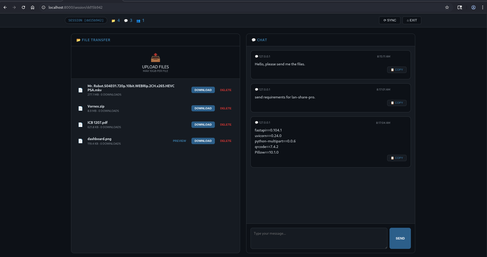
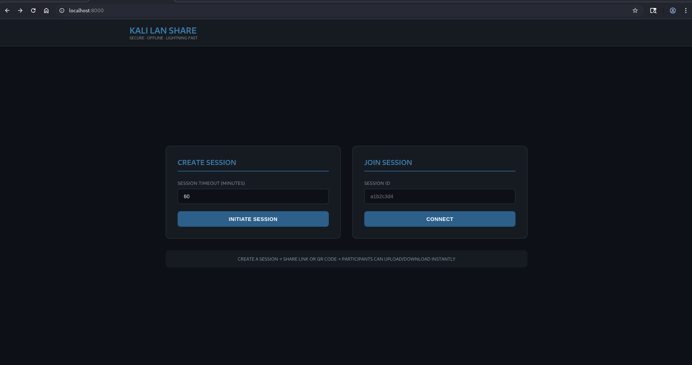

# 🚀 Kali LAN Share — Offline File Sharing System

<p align="center">
  
</p>

<p align="center">
  <b>⚡ Offline • Fast • Zero Setup LAN File Sharing</b>
</p>

---

A **high-performance LAN file sharing + chat system** built with **FastAPI**.

No internet required — just connect to the same network and share instantly.

---

## ✨ Features

* ⚡ Fast file transfer (up to 10GB)
* 📡 Works fully offline (LAN only)
* 🔗 Session-based sharing
* 📱 QR code join
* 💬 Built-in chat (with copy button)
* 📊 Download tracking
* 👥 Peer detection
* 🧹 Auto session cleanup
* 👀 File preview (text/images)

---

## 📸 Preview

### 🏠 Home Page

<p align="center">
  
</p>

---

### 💻 Session Dashboard

<p align="center">
  
</p>

---

## 🧠 How It Works

```text
Start → Create Session → Share Link/QR → Join → Transfer Files
```

---

## 📦 Requirements

* Python 3.9+
* pip

---

## ⚙️ Installation

### 🪟 Windows

```bash
git clone https://github.com/valentino-scott/kali-lan-share.git
cd kali-lan-share

python -m venv venv
venv\Scripts\activate

pip install fastapi uvicorn python-multipart qrcode[pil]

python share.py
```

---

### 🐧 Linux (Temporary Run)

```bash
git clone https://github.com/valentino-scott/kali-lan-share.git
cd kali-lan-share

python3 -m venv venv
source venv/bin/activate

pip install fastapi uvicorn python-multipart qrcode[pil]

python3 share.py
```

---

## ⚡ Permanent Installation (Linux)

Install system-wide so you can run with:

```bash
share
```

### Steps:

```bash
# Clone to /opt (recommended for system apps)
sudo git clone https://github.com/valentino-scott/kali-lan-share.git /opt/kali-share

cd /opt/kali-share

# Install dependencies globally (or inside venv if preferred)
sudo pip3 install fastapi uvicorn python-multipart qrcode[pil]

# Create command wrapper
sudo tee /usr/local/bin/share > /dev/null <<'EOF'
#!/bin/bash
cd /opt/kali-share
python3 share.py
EOF

# Make executable
sudo chmod +x /usr/local/bin/share
```

### Run:

```bash
share
```

---

## 🍎 macOS

```bash
git clone https://github.com/valentino-scott/kali-lan-share.git
cd kali-lan-share

python3 -m venv venv
source venv/bin/activate

pip install fastapi uvicorn python-multipart qrcode[pil]

python3 share.py
```

---

## ▶️ Usage

After running:

```bash
Local:   http://localhost:8000
Network: http://192.168.x.x:8000
```

### Steps:

1. Open browser → `http://localhost:8000`
2. Create session
3. Share link or QR
4. Join from another device
5. Transfer files

---

## 📂 Structure

```bash
.
├── share.py
├── assets/
└── README.md
```

---

## ⚡ Performance

* Faster than `python -m http.server`
* Handles large files (GBs)
* Multiple users supported

---

## 🔐 Security

* LAN-only by design
* No authentication (for speed)

⚠️ Do not expose publicly without security layer

---

## 🧹 Session Behavior

* Timeout: 60 minutes
* Auto deletes all session data

---

## 🧑‍💻 Author

**valentino-scott**

---

## ⭐ Support

* Star the repo
* Fork it
* Improve it

---

## ⚠️ Disclaimer

For local network use only.

---
